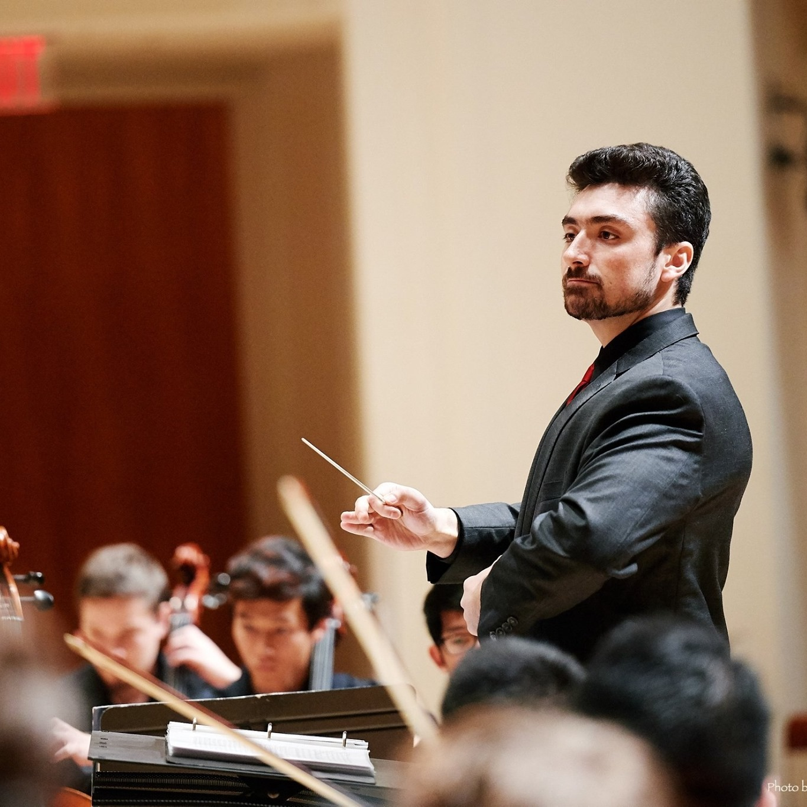
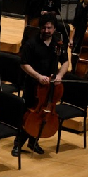

Welcome to my site! It's currently a work in progress.  
===
My research focuses on advancing Artificial Intelligence (A.I.) through reverse-engineering biological brains.  I believe most of the large improvements in A.I. have come about through this method, from reinforcement learning to Deep Neural Networks.  

However, deep learning has made tremendous strides, so I do not think it is pertinent to throw out those gains.  Rather, I am interested in creating *hybrid* systems, that can combine new insights from biology to new-gen networks from deep learning. 
Specifically, I am focused on the issue of temporal data, which is difficult for current deep learning methods to learn, I believe due to the incompatibility of the backpropagation algorithm with current recurrent neural networks.  I research what are
known as *reservoir computers*, random recurrent neural networks, and develop hybrid networks that take advantage of the temporal capabilities of reservoirs with the power of deep learning with backpropagation.

I call these new networks *Hybrid Recurrent Networks*.  

I am advised by Yiannis Aloimonos and Cornelia Fermuller in the Computer Science Department and UMIACS. 

Non-Academic Pursuits
===

I am a lover of music, and a former Conductor, arranger, and cellist for the [UMD Gamer Symphony Orchestra](http://umd.gamersymphony.org/homepage.php).  My conducting can be found on the GSO youtube site.

I also enjoy the rain, Joseph Joestar, jazz piano, and politics. 

