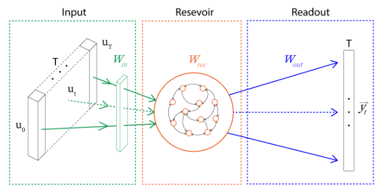
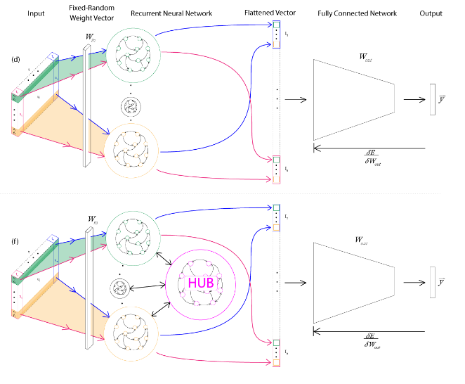

Welcome to my site! It's currently a work in progress. 
===
My research focuses on advancing Artificial Intelligence (A.I.) through reverse-engineering biological brains.  I believe most of the large improvements in A.I. have come about through this method, from reinforcement learning to Deep Neural Networks. 

However, deep learning has made tremendous strides, so I do not think it is pertinent to throw out those gains.  Rather, I am interested in creating *hybrid* systems, that can combine new insights from biology to new-gen networks from deep learning. 
Specifically, I am focused on the issue of temporal data, which is difficult for current deep learning methods to learn, I believe due to the incompatibility of the backpropagation algorithm with current recurrent neural networks.  I research what are
known as *reservoir computers*, random recurrent neural networks, and develop hybrid networks that take advantage of the temporal capabilities of reservoirs with the power of deep learning with backpropagation.

The brain is known to be highly recurrent, with almost every area covered with recurrent or cyclical connections.  However, it is my hypothesis that RNNs are incompatible with current methods of
gradient-based learning, such as in LSTMs.  My goal is to create new networks that are capable of handling temporal data, and temporal memory, in a way that jams with the current state of gradient-based learning. I
thus sit at the intersection of computational neuroscience, deep learning, and machine learning.  

I call these new networks *Hybrid Recurrent Networks* - networks capable of recurrent computation without the pitfalls of current RNN approaches. 

These networks can either be *rate encoding* like traditional deep networks, or *spiking* like the action potentials in the brain. 

I am advised by Yiannis Aloimonos and Cornelia Fermuller in the Computer Science Department and UMIACS.  I am also a UMD COMBINE Fellow; my COMBINE advisor is Michelle Girvan. 

Non-Academic Pursuits
===

I am a lover of music, and a former Conductor, arranger, and cellist for the [UMD Gamer Symphony Orchestra](http://umd.gamersymphony.org/homepage.php).  My conducting can be found on the GSO youtube site. You can find my performance of Final Fantasy 15 suite [here](https://www.youtube.com/watch?v=EBFBas9E-O0).

I also enjoy the rain, Joseph Joestar, jazz piano, and politics. 

